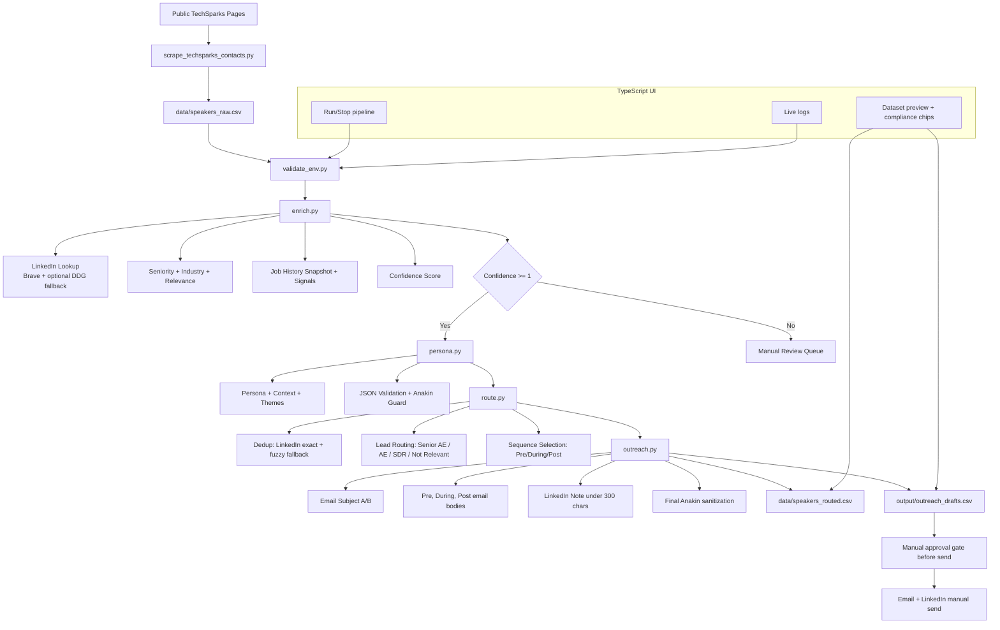

# TechSparks GTM Automation - Workflow Diagram

## Notes

- The fast path (`python src/pipeline.py --fast`) is used for rapid full-output generation.
- Live mode (`--live`) is available for evidence sampling with real web/LLM calls.
- No outbound messaging is auto-sent; drafts are generated and manually approved.
